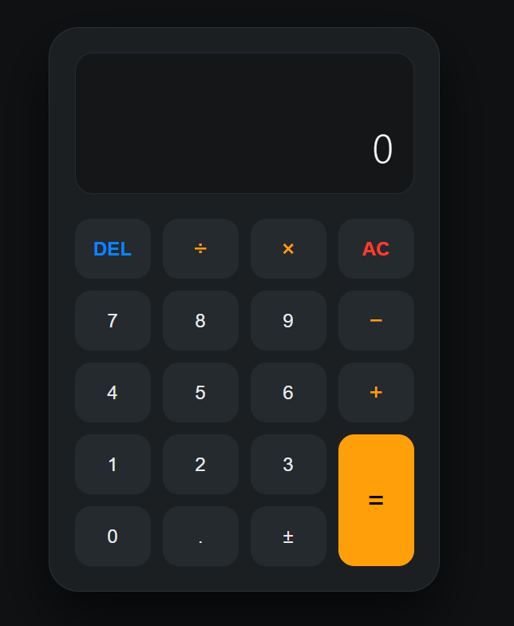

# Modern Web Calculator 🧮

A sleek, responsive, and functional web calculator project with a modern dark theme, developed as part of my second-year studies in the Faculty of Computer Science and AI.

## 🚀 Overview
This project showcases a professional frontend workflow, focusing on clean UI/UX design and a modular folder structure. The calculator supports basic arithmetic operations with an interface inspired by modern operating systems.

## 📸 Preview

## 🛠 Tech Stack
* **HTML5:** Structured semantic markup.
* **CSS3:** Custom styling featuring a Dark Mode theme, grid layouts, and responsive design.
* **JavaScript:** Logic for mathematical calculations and UI interactions.

## 📂 Project Architecture
The project follows professional standards for folder organization:
* `/CSS`: Contains the styling logic (`style.css`).
* `/js`: Contains the functional logic (`script.js`).
* `/assets/images`: Stores project media like the `calc-preview.png`.
* `index.html`: The main entry point of the application.

## 📝 Key Features
* **Modern UI:** Clean dark theme with an orange primary action button for equals.
* **Professional Organization:** Files are separated by concern (HTML, CSS, JS).
* **Responsive Layout:** Designed to look great on various screen sizes.

## 👨‍💻 About Me
I am a second-year Computer Science and AI student focused on building a solid foundation in software development, including OOP with Java and web technologies.